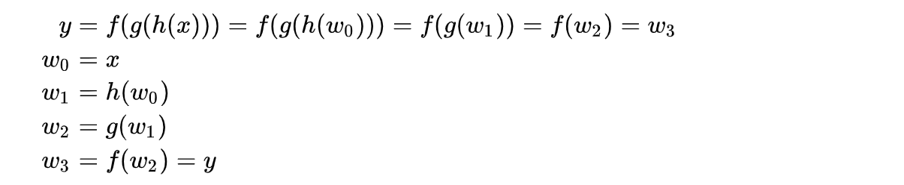
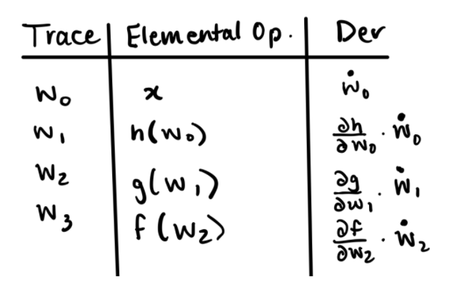

# Documentation

## Introduction

Differentiation plays a key role in modern algorithms in various fields of computational analysis, such as statistics, physics, machine learning and deep learning which are hot topics in recent years. Newton's method for finding roots of functions without closed-form solution, backward propagation in training neural networks, and optimization (e.g. gradient descent) in machine learning algorithms, all rely on differentiation as their cornerstone. Therefore, the ability to quickly, accurately and efficiently compute differentiation is crucial.

There are many ways to compute derivatives in a machine, for example, numerical differentiation and symbolic differentiation. For symbolic differentiation, it computes the expression of the derivative symbolically. This method is convenient for simple expressions, but can be inefficient and difficult to compute when the expression goes complex to higher orders, especially for gradient descent in machine learning when the target function has a complex form.

Numerical differentiation relies on finite-differences  as  goes to 0 to approximate the value of derivatives at a specific point. However, choosing the most appropriate  value is not an easy job. When the  is too small, it has the problem of round-off errors associated with machine precision, and the approximation can be inaccurate when the  is too large.

"Automatic Differentiation (AD)", is a technique to compute derivatives numerically at a specified point, and surpasses the above two methods e in both time and resource efficiency and computational accuracy. Taking the symbolic derivative of a function can be difficult for a computer to implement as the function becomes more complex. Specifically, vectorized functions are especially difficult to take derivatives of symbolically so AD is useful in allowing users to take the gradient of complex functions at particular numerical values using the function’s computational graph. Furthermore, AD completes the numerical derivatives without losing accuracy and also improves computational speed compared to traditional symbolic derivatives for complex functions.

In our lagh_ad package, we implement the AD for both forward and reverse mode. For forward mode, the Jacobian function is also included to compute Jacobian matrix for vector inputs of vector function. In section 2, you can find the details and mathematical background of AD. In section 3, you will get a sense of how to use our package. Section 4 and 5 provide a detailed introduction about how our package is planned. Section 6 is the short motivation for our license choice.

## Background

How do you use numerical methods like automatic differentiation to take derivatives of functions? Automatic differentiation is based on the chain rule, ex. der(sin(2x)) = der(sin2x)\*der(2x). Using this notation, and the fact that computers evaluate functions one elementary function at a time based on order of operator precedence, we are able to implement a simpler way of evaluating derivatives numerically. Every complex function can be broken down into a combination of elementary functions (ex. sin(cos(x)) is nothing more than first taking the cos(x), then taking the sin of that result). An elementary function is either (1) a simple function of one variable like squaring, sin, cos etc., or (2) a simple function of two variables like add, multiply etc. Complex functions can be expressed as a computational graph of elementary functions, and this makes it easy for computers to find the value of the complex function for different inputs. In AD, we are computing the derivative of the function while we are computing the value of the function at a given input. The AD method assumes that it is easy to find the value and derivative of each elementary function, which is easily satisfied in practice.

Let us consider the task of evaluating the following function from [Wikipedia](https://en.wikipedia.org/wiki/Automatic_differentiation) and finding its derivative:



The complex function f(g(h(x))) can be broken down into intermediate variables w0 through w3. First w0 = x, and for w0 we will find its value and derivative for a given value of x. We then “unwrap” the function from the inside out using successive intermediate values. For example, w1 = h(w0). Since we know the value of w0 for a given value of x, it is easy to compute the value of w1. Similarly, since we know the derivative of w0 with respect to input x, it is easy to compute the derivative of w1 using the chain rule. Similarly we can find the derivative of function y with respect to the input variable x by composing the intermediate results using chain rule as follows:


Using this theory we can find the derivative of y above using AD. To do this, we construct a computational graph, with each intermediate as a circular node. Above each arrow is the elementary function that maps the input to output values:


Using the computational graph and the chain rule, while evaluating the values for the intermediate variables we can simultaneously compute their derivatives. Plugging in previous values into successive rows yields a final value for the derivative using AD.



Each “row” in this table can be represented by a data structure called a dual number. A dual number takes the form of (b + c$\epsilon$) where $\epsilon$^2 = 0. In the dual number structure, b is the value of the function for a particular input x, and c is the derivative of the function with respect to that value of x. The final result of AD is the final row of the table above, and we can return a dual number to represent the value of the function y and the derivative of y at a particular x.

If there are multiple input variables, then each intermediate variable can have multiple partial derivatives corresponding to each of the inputs. In the case of multiple input variables, forward AD computes a Jacobian-vector product that consists of a matrix of each function’s partial derivatives evaluated at a point. Since a dual number can only store one derivative value in the dual part, each pass through AD will find the partial derivative of y with respect to a particular input variable. To specify which partial derivative to extract, you can set a “seed vector” p of your choosing (ex. For f(x1,x2), you can set p to [1,0] to find the partial derivative of the function with respect to input x1). At each intermediate variable, you consider the vector p and focus on deriving the partial derivative with respect to x1. You can take the dot product of the gradient (list of partial derivatives of the function) and seed vector p to get the partial derivative of the function with respect to input x1.

## How to use _lahg_package_

### Installation Method 1: Install from our Git repository

#### Install Python and Git

To use our package, you will need to install up-to-date version of Python and Git. You can download Python 3.10.0 [here](https://www.python.org/downloads/) and Git 2.0.1 [here](https://git-scm.com/book/en/v2/Getting-Started-Installing-Git).

#### Clone our repository

To install our automatic differentiation package in your computer. You will need to clone the github repository using the following Linux command in the specified local folder:

```

git clone https://github.com/cs107-lahg/cs107-FinalProject.git

```

#### Install dependencies

You will need to install necessary dependencies in order to use the package properly. This can be done using the Linux command after navigating to the directory containing the **requirements.txt** file:

```

pip install -r requirements.txt

```

### Installation Method 2: Install from PyPI
......


### AD forward mode and Jacobian

Then users can import the package and all modules included using the command:

```python

import lagh_ad as ad

```

To make use of forward automatic differentiation function, users will need to initiate AD variables/objects with value at a specified point and pass the derivative seed, for example

```python

x = ad.make_variable(2,1)

y = ad.make_variable(0,1)

f = (x * y + np.sin(x) + 1 - np.cos(y))**0.5

print(f)
 
```
### AD reverse mode

To make use of our AD reverse mode function, users will need to initiate RD objects with value which should be a numpy one-dimensional array, in either scalar or vector input case. For example:
 
 ```python
 
 # for scalar inputs
 
 x = RD(np.array([1]))
 
 y = RD(np.array([2]))
 
 f = x * y
 
 print(x.get_derivative())
 
 print(y.get_derivative())


# for vector inputs

 x = RD(np.array([1, 2, 3]))
 
 y = RD(np.array([2, 3, 4]))
 
 f = x * y
 
 print(x.get_derivative())
 
 print(y.get_derivative())

 ```

## Software Organization

### Directory structure and modules

```
lagh_ad
├── README.md               Main project README
├── requirements.txt        Package dependencies
├── setup.py                setup function for package
│
├── docs/                   Main project documentation
│   ├── figures/            Folder for figures
│   ├── README.md           README for docs
|   ├── documentation.md    Final Documentation for lahg_ad package
│   └── milestone[x].md     Documentation for each milestone
│
├── dev/                    Project planning/development (optional)
│
├── cov_report/             Contains local code coverage report
│
├── src/                    Package source files
│   ├── fd.py               Main constructor for forward mode
|   ├── Jacobian.py         Helper functions to compute Jacobian Matrix
│   └── rv.py               Reverse mode 
│
└── tests/                  Package test scripts
    ├── run_tests.py        script that runs all tests
    └── test_[x].py         tests [x].py
```

### Basic modules and what they do

- The FD module performs the automatic differentiation forward mode.

- The RD module performs the automatic differentiation reverse mode.

- The helper module contains function to compute Jacobian matrix of vector function using forward mode.

### Where do the tests live? How are they run? How are they integrated?

- The tests lie under tests repository containing three testing file -- **test_fd.py**, **test_rd.py**, **test_helper.py** **test_composite_functions.py** that tests the forward mode, reverse mode, helper function and composite function respectively.

- Travis CI and CodeCov are used to test our package and check code coverage after every commit that changes lahg_ad/ files.

- The Travis CI system syncs with our package on GitHub. The system clones the GitHub repository to a build environment, which is an isolated virtual machine. The system then processes the `.travis.yml` config file and reports the build results back to our `README.md` file on GitHub. The build environment gets terminated once the build is completed.

- CodeCov syncs with our package on GitHub. The system runs the tests in `test_fd.py` and `test_composite_functions.py` and generates code coverage reports. The final code coverage is reported back as a percentage to our `README.md` file, reflecting how much code our test suite covers.

- Note: We are on a free trial of TravisCI which will work for this milestone, however we will explore other CI (such as CirclesCI) for the final milestone and futureproofing our package when our trial period is over. To run out tests locally you can run the following line in the terminal. This saves the coverage report to a folder `cov_report`.

### How can someone install your package? Should developers and consumers follow a different installation procedure?

- A walkthrough of how to install _lahg_package_ is described in the _How to use lahg_package_ section above. There are two methods to install our package: using Git or PyPI.

## Implementation details

### ### Core data structures

For forward mode, the core data structures we used for our implementation are numpy arrays and python dictionaries to store our partial derivatives. For reverse mode, except from the data structures used in forward mode, python list and tuple is also used to store the parent-child relationship for compute derivative recursively.

### Classes

For forward mode, we created one class called the Variable class, which handles our automatic differentiations. Within the class, we defined some parameters within our function, including self.val and self.der, which are the value and derivatives of a Variable object. For inverse mode, we created one class called RD calss, within which we defined parameters self.val, self.der, and self.child that are the value, derivative and child of a RD object.

### Important attributes

The class methods for our Forward/Reverse Mode Implementation are described below.

| **Class Methods**   | **Usage**                                                                                                                                                                                                                                                                                                                                                                                                                                                                                                                                                                                                                                                                                                                                                                                                 |
| ------------------- | --------------------------------------------------------------------------------------------------------------------------------------------------------------------------------------------------------------------------------------------------------------------------------------------------------------------------------------------------------------------------------------------------------------------------------------------------------------------------------------------------------------------------------------------------------------------------------------------------------------------------------------------------------------------------------------------------------------------------------------------------------------------------------------------------------- |
| \_\_init\_\_        | This method initializes a Variable object by initializing self.val and self.der variables. Specifically, self.val is set to the value passed into the function and self.der is set to 1. The method also checks whether the value and derivative seed are int or float. Otherwise it will raise a TypeError exception                                                                                                                                                                                                                                                                                                                                                                                                                                                                                     |
| \_\_repr\_\_        | This method returns a printed representation of the attributes of the Variable object, specifically its value and its derivative                                                                                                                                                                                                                                                                                                                                                                                                                                                                                                                                                                                                                                                                          |
| self.get_value      | This method returns the value of a Variable object                                                                                                                                                                                                                                                                                                                                                                                                                                                                                                                                                                                                                                                                                                                                                        |
| self.get_derivative | This method returns the derivative of a Variable object                                                                                                                                                                                                                                                                                                                                                                                                                                                                                                                                                                                                                                                                                                                                                   |
| \_\_neg\_\_         | This method negates the value and derivative of a Variable Object and returns a new Variable Object.                                                                                                                                                                                                                                                                                                                                                                                                                                                                                                                                                                                                                                                                                                      |
| self.sin            | This method returns a new Variable Object with a new value that equals np.sin(self.val) and a new derivative that equals np.cos(self.val) \* self.der. The derivative makes use of the chain rule. The function returns the new Variable object                                                                                                                                                                                                                                                                                                                                                                                                                                                                                                                                                           |
| self.cos            | This method returns a new Variable Object with a new value that equals np.cos(self.val) and a new derivative that equals np.sin(self.val) \* self.der. The derivative makes use of the chain rule. The function returns the new Variable object                                                                                                                                                                                                                                                                                                                                                                                                                                                                                                                                                           |
| self.tan            | This method returns a new Variable Object with a new value that equals np.tan(self.val) and a new derivative that equals (1 / (np.cos(self.val) \*\* 2))\* self.der. The derivative makes use of the chain rule. The function returns the new Variable object                                                                                                                                                                                                                                                                                                                                                                                                                                                                                                                                             |
| self.arcsin         | This method returns a new Variable Object with a new value that equals np.arcsin(self.val) and a new derivative that equals 1 / np.sqrt(1 - self.val \*\* 2) \* self.der. The derivative makes use of the chain rule. The function returns the new Variable object. Since the domain of arcsin ranges from -1 to 1, we throw a ValueError when the absolute value of self.val is >= 1.                                                                                                                                                                                                                                                                                                                                                                                                                    |
| self.arccos         | This method returns a new Variable Object with a new value that equals np.arccos(self.val) and a new derivative that equals - 1 / np.sqrt(1 - self.val \*\* 2) \* self.der. The derivative makes use of the chain rule. The function returns the new Variable object. Since the domain of arcsin ranges from -1 to 1, we throw a ValueError when the absolute value of self.val is >= 1.                                                                                                                                                                                                                                                                                                                                                                                                                  |
| self.arctan         | This method returns a new Variable Object with a new value that equals np.arctan(self.val) and a new derivative that equals 1 / (1 + self.val \*\* 2) \* self.der. The derivative makes use of the chain rule. The function returns the new Variable object                                                                                                                                                                                                                                                                                                                                                                                                                                                                                                                                               |
| self.sinh           | This method returns a new Variable Object with a new value that equals np.sinh(self.val) and a new derivative that equals np.cosh(self.val) \* self.der. The derivative makes use of the chain rule. The function returns the new Variable object                                                                                                                                                                                                                                                                                                                                                                                                                                                                                                                                                         |
| self.cosh           | This method returns a new Variable Object with a new value that equals np.cosh(self.val) and a new derivative that equals np.sinh(self.val) \* self.der. The derivative makes use of the chain rule. The function returns the new Variable object                                                                                                                                                                                                                                                                                                                                                                                                                                                                                                                                                         |
| self.tanh           | This method returns a new Variable Object with a new value that equals np.tanh(self.val) and a new derivative that equals (1 / (np.cosh(self.val) \*\* 2)) \* self.der. The derivative makes use of the chain rule. The function returns the new Variable object                                                                                                                                                                                                                                                                                                                                                                                                                                                                                                                                          |
| self.exp            | This method returns a new Variable Object with a new value that equals e^(self.val)^ and a new derivative that equals e^self.der^ \* self.der. The derivative makes use of the chain rule. The function returns the new Variable object                                                                                                                                                                                                                                                                                                                                                                                                                                                                                                                                                                   |
| \_\_eq\_\_          | This method returns True if self.val equals other.val and self.der equals other.der. Otherwise it returns False.                                                                                                                                                                                                                                                                                                                                                                                                                                                                                                                                                                                                                                                                                          |
| \_\_ne\_\_          | This method returns False if self.val equals other.val and self.der equals other.der. Otherwise it returns True.                                                                                                                                                                                                                                                                                                                                                                                                                                                                                                                                                                                                                                                                                          |
| \_\_add\_\_         | This method adds the values and derivatives of two Variable objects together then returns the new Variable object. In the case of an AttributeError, the function returns a Variable object where its value is self.val + other, and its derivative is self.der. This method overloads the + operator                                                                                                                                                                                                                                                                                                                                                                                                                                                                                                     |
| \_\_sub\_\_         | This method subtracts the values and derivatives of two Variable objects then returns the new Variable object. In the case of an AttributeError, the function returns a Variable object where its value is self.val - other, and its derivative is self.der. This method overloads the - operator                                                                                                                                                                                                                                                                                                                                                                                                                                                                                                         |
| \_\_mul\_\_         | This method multiplies the values and derivatives of two Variable Objects by using simple multiplication and the product rule. The function returns the new Variable object. In the case of an Attribute error, the function returns a Variable object where its value is self.val \* other, and its derivative is self.der \* other. This method overloads the \* operator                                                                                                                                                                                                                                                                                                                                                                                                                               |
| \_\_truediv\_\_     | This method divides the values and derivatives of two Variable Objects by using simple division and the quotient rule. The function returns the new Variable object. In the case of an Attribute Error, the function returns a Variable object where its value is self.val / other and its derivative is self.der / other. The function also checks whether the denominator equals zero. In this case, we raise a ZeroDivisionError with an error message "Cannot divide by zero". This method overloads the / operator                                                                                                                                                                                                                                                                                   |
| \_\_pow\_\_         | This method returns a new Variable object where the value is raised to the power specified and the derivative is calculated depending on whether self.val is less than or equal to 0, or it is greater than 0. If self.val <= 0, the derivative equals other.val \* self.val \*\* (other.val - 1) \* self.der. Otherwise, the derivative equals other.val \* self.val \*\* (other.val - 1) \* self.der + np.log(self.val) \* self.val \*\* other.val \* other.der. In the case of an Attribute Error, if self.val <=0 and other is between 0 and 1, a ValueError is raised because we cannot take the derivative of the root of a non-positive number. If self.val == 0 and other < 0, a ValueError is raised because we cannot raise to the negative power of 0. This method overloads the \*\* operator |
| \_\_rpow\_\_        | This method returns a new Variable Object where the value equals other \*\* self.val and the derivative equals np.log(other) \* other \*\* self.val \* self.der                                                                                                                                                                                                                                                                                                                                                                                                                                                                                                                                                                                                                                           |
| self.log            | This method returns a new Variable Object where the value equals np.log(self.val) and the derivative equals (1/self.val)\*self.der. This function also raises a ValueError when self.val <=0 as we cannot take the log of a non-positive number                                                                                                                                                                                                                                                                                                                                                                                                                                                                                                                                                           |
| self.sqrt           | This method makes use of \_\_pow\_\_. It returns self.\_\_pow\_\_(0.5).                                                                                                                                                                                                                                                                                                                                                                                                                                                                                                                                                                                                                                                                                                                                   |
| \_\_radd\_\_        | This method returns the \_\_add\_\_ dunder method with the other object passed in as input                                                                                                                                                                                                                                                                                                                                                                                                                                                                                                                                                                                                                                                                                                                |
| \_\_rmul\_\_        | This method returns the \_\_mul\_\_ dunder method with the other object passed in as input                                                                                                                                                                                                                                                                                                                                                                                                                                                                                                                                                                                                                                                                                                                |
| \_\_rsub\_\_        | This method returns other + (-self)                                                                                                                                                                                                                                                                                                                                                                                                                                                                                                                                                                                                                                                                                                                                                                       |
| \_\_rtruediv\_\_    | This method is similar to \_\_truediv\_\_, however instead of self/other, \_\_rtruediv\_\_ handles the case of other/self                                                                                                                                                                                                                                                                                 
### External dependencies

For external dependencies, we relied on numpy for our elementary operations. We also used setuptools to set up our package facilitate easy installation and distribution.

To test our code, we also relied on pytest, pytest-cov and coverage.

### Elementary functions

Descriptions of the implementation of our elementary functions are found in the _Important Attributes_ section above. When calculating the derivative, we make use of the chain rule when appropriate. We also raise exceptions for possible errors such as ValueError, ZeroDivisionError and AttributeError. Currently, our implementation supports scalar inputs, but we will adjust our functions in our next milestone to take vectors as input as well.

## Extension

### new/future feature section of the documentation from Milestone 2 

In our next milestone, we want to implement a Jacobian module to compute automatic differentiation for vector input of vector functions. In order to do that, we will include a new module called Jacobian. The package functions will change since we will have to now have to have a vector of values and a vector of derivatives and also support vector-valued operations. We will implement this by leveraging our current scalar-valued implentation.

We do not expect our folder structure to change very much, all our package-related functions will live in `lahg_ad` and become part of our main package, and we will test our code the same way.

We will also include a new module that implements reverse-mode automatic differentiation. The primary challenge would be the process of storing a whole computation graph described in the Background section. We will have to think about how to best store this computational graph, and how to best represent this to the user.

By traversing the computational graph backwards, reverse mode recovers the partial derivatives of the $i$th output $f_i$ with respect to the n variables $v_{j-m}$ with $j = 1,2,3,...,n$. Reverse mode computes the sensitivity of $f$ with respect to the independent and intermediate variables $v_{j-m}$. There are two passes in reverse mode: forward pass and reverse pass.

The forward pass computes the partial derivative using the elementary functions, but does not use the chain rule. We do not need to apply the chain rule because this will be "built up" in the reverse pass. The reverse pass reconstructs the chain rule that was ignored in the forward pass. We will initialize $\bar{v}_i = 0$ then iterate over the children $j$ of node $i$, updating the values with $\bar{v}_i = \bar{v}_i + \frac{df}{dv_j} \frac{dv_j}{dv_i} = \bar{v}_i + \bar{v}_j \frac{dv_j}{dv_i}$. After we've iterated over all the children nodes for node $i$, we can update the parent nodes.

With this in mind, we plan to build a graph of nodes starting with our x and/or y inputs. Starting with the forward pass, x and/or y will become the root of our graph. As we build our expression, we would create a child node on our graph for each operation we perform. This would allow us to easily perform a reverse pass as we've created a parent-child relationship between the nodes. The gradient computations will be saved in our nodes and we would be able to use those weights in the reverse pass.

Milestone 2 Feedback: 

### Description of your extension

We have two extensions from Milestone 2. First, the AD forward mode is extended to deal with vector inputs for value and derivative to compute the Jacobian matrix. The main data structure to realize that is numpy array. 

For AD reverse mode, our algorithm "stores" the computation graph -- the relationship between "parent" node and "child" node in a Python list. Once the function computation is done following the computational graph, the get derivative method is called on the "root" node, the algorithm computes its derivative recursively from all of its children, and finally updates the derivative of the "root" node. 

### Background of AD reverse mode

AD reverse mode sets up the computational trace using the same computational graph as AD forward mode, but it computes the derivative in the opposite direction of the computational graph. It surpasses forward mode in the aspect of efficiency, since it computes multiple partial derivatives at one shot, while forward mode must be performed multiple times. AD reverse mode is widely used in machine learning algorithms such as backward propagation.

The fundamental theory behind reverse mode is chain rule, and each outgoing arrow from a variable contributes to the corresponding adjoint variable by its term in the chain rule following the computation graph. For example, here is a simple function: 

Following is its computational graph:


The final derivative with respect to  and  are computed as:


For more details, please refer to [Automatic Differentiation Wikipedia](https://en.wikipedia.org/wiki/Automatic_differentiation) page.


## Broader Impact and Inclusivity Statement

### The potential broader impacts and implications of your software

Automatic differentiation has large impact in many fields in including Statistics, Mathematics, Bioinformatics, Machine Learning and so on. Its application diverges in various context not only in scientific research, but also in business and governance. Nowadays these data-driven technologies that employs automatic differentiation as its basic algorithm has shaped the world to be a better one. It provides more accurate fiancial service using NLP, provide medical artificial intelligence to advice physicians, as well as making more accuracy predictions of Economic treand.

As developed in recent years, machine learning and deep learning technologies have been applied in many fields, expecially in IT industry for advertisement recommendation, user classification, and facial recognization. However, these applications rely on the collection and potential misuse of personal data, sometimes without their awareness and consent. In this aspect, these applications are at risk causing harms to the society and public.

After though consideration, we still would like to distribute our package on PyPI, as its benefits overweight its potential harms. We also require all those would like to make use of this package be aware of the negative impact of these technologies.

### How is your software inclusive to the broader community?

 The package is freely distributed through PyPI, it should be accessible to anyone who has Internet access. Those who are interested in applying automatic differentiation function can easily install our package through either Github or PyPI, but we have also recognized that lack of Internet access could be a potential problem of accessing this package. 
 
 Our code is also open-sourced under the protection of MIT license, which means everyone could contribute to our code base, which is welcomed and encouraged. Our teammates will review the pull request and carefully evaluate the quality of code contribution without discriminating against race, color, religion, gender, gender expression, age, national origin, disability, marital status, sexual orientation, or military status, in any of its activities or operations. If a pull request is rejected, detailed comments will be provided.

## Future

- Currently, our package can only take in scalar or vector inputs, but computing derivatives for matrix computation could also be useful in many scenarios, such as in gradient descent algorithm in many machine learning applications. In the future, we would like to extend the functionality of our project to be able to handle matrix differentiation.

- As stated in the __introduction__ section, automatic differentiation has application in various fields. In our next step, we would like to extend our package to solve optimization problems such as gradient descent in linear regression, or backward propagation in training neural networks. Besides, writing a root-sfinding function is also a great future extension given that we already have AD forward/reverse mode in hand. These methods will have great importance to solve problems that arise in machine learning, biomedical research, finance, etc. 

- Now our package can only compute first-order derivative. In the near future, we would like to extend our package to include higher order derivative, which has broad applications in Mathematics, Statistics Fluid Machanics.
