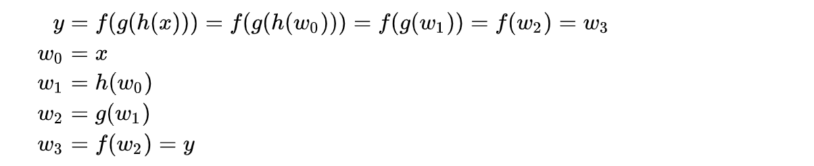
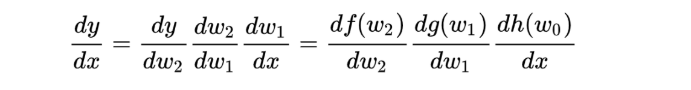
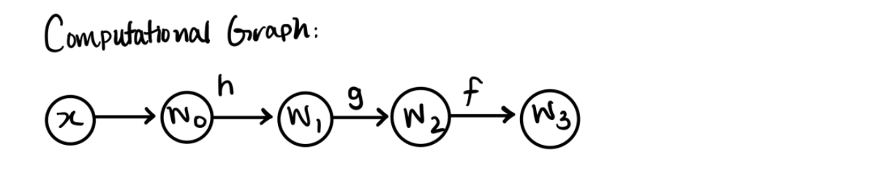
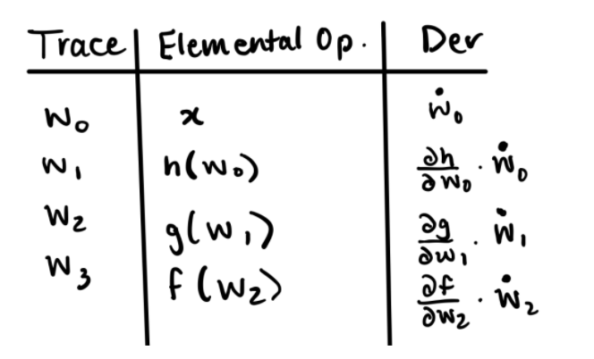

# Milestone 2 Documentation

## Introduction

Differentiation plays a key role in modern algorithms in various fields of computational analysis, such as statistics, physics, machine learning and deep learning which are hot topics in recent years. Newton's method for finding roots of functions without closed-form solution, backward propagation in training neural networks, and optimization (e.g. gradient descent) in machine learning algorithms, all rely on differentiation as their cornerstone. Therefore, the ability to quickly, accurately and efficiently compute differentiation is crucial.

There are many ways to compute derivatives in a machine, for example, numerical differentiation and symbolic differentiation. For symbolic differentiation, it computes the expression of the derivative symbolically. This method is convenient for simple expressions, but can be inefficient and difficult to compute when the expression goes complex to higher orders, especially for gradient descent in machine learning when the target function has a complex form.

Numerical differentiation relies on finite-differences  as  goes to 0 to approximate the value of derivatives at a specific point. However, choosing the most appropriate  value is not an easy job. When the  is too small, it has the problem of round-off errors associated with machine precision, and the approximation can be inaccurate when the  is too large.

"Automatic Differentiation (AD)", is a technique to compute derivatives numerically at a specified point, and surpasses the above two methods e in both time and resource efficiency and computational accuracy. Taking the symbolic derivative of a function can be difficult for a computer to implement as the function becomes more complex. Specifically, vectorized functions are especially difficult to take derivatives of symbolically so AD is useful in allowing users to take the gradient of complex functions at particular numerical values using the function’s computational graph. Furthermore, AD completes the numerical derivatives without losing accuracy and also improves computational speed compared to traditional symbolic derivatives for complex functions.

In our lagh_ad package, we implement the AD for both forward and reverse mode (The extension we choose). In section 2, you can find the details and mathematical background of AD. In section 3, you will get a sense of how to use our package. Section 4 and 5 provide a detailed introduction about how our package is planned. Section 6 is the short motivation for our license choice.

## Background

How do you use numerical methods like automatic differentiation to take derivatives of functions? Automatic differentiation is based on the chain rule, ex. der(sin(2x)) = der(sin2x)\*der(2x). Using this notation, and the fact that computers evaluate functions one elementary function at a time based on order of operator precedence, we are able to implement a simpler way of evaluating derivatives numerically. Every complex function can be broken down into a combination of elementary functions (ex. sin(cos(x)) is nothing more than first taking the cos(x), then taking the sin of that result). An elementary function is either (1) a simple function of one variable like squaring, sin, cos etc., or (2) a simple function of two variables like add, multiply etc. Complex functions can be expressed as a computational graph of elementary functions, and this makes it easy for computers to find the value of the complex function for different inputs. In AD, we are computing the derivative of the function while we are computing the value of the function at a given input. The AD method assumes that it is easy to find the value and derivative of each elementary function, which is easily satisfied in practice.

Let us consider the task of evaluating the following function from [Wikipedia](https://en.wikipedia.org/wiki/Automatic_differentiation) and finding its derivative:



The complex function f(g(h(x))) can be broken down into intermediate variables w0 through w3. First w0 = x, and for w0 we will find its value and derivative for a given value of x. We then “unwrap” the function from the inside out using successive intermediate values. For example, w1 = h(w0). Since we know the value of w0 for a given value of x, it is easy to compute the value of w1. Similarly, since we know the derivative of w0 with respect to input x, it is easy to compute the derivative of w1 using the chain rule. Similarly we can find the derivative of function y with respect to the input variable x by composing the intermediate results using chain rule as follows:



Using this theory we can find the derivative of y above using AD. To do this, we construct a computational graph, with each intermediate as a circular node. Above each arrow is the elementary function that maps the input to output values:



Using the computational graph and the chain rule, while evaluating the values for the intermediate variables we can simultaneously compute their derivatives. Plugging in previous values into successive rows yields a final value for the derivative using AD.



Each “row” in this table can be represented by a data structure called a dual number. A dual number takes the form of (b + c$\epsilon$) where $\epsilon$^2 = 0. In the dual number structure, b is the value of the function for a particular input x, and c is the derivative of the function with respect to that value of x. The final result of AD is the final row of the table above, and we can return a dual number to represent the value of the function y and the derivative of y at a particular x.
If there are multiple input variables, then each intermediate variable can have multiple partial derivatives corresponding to each of the inputs. In the case of multiple input variables, forward AD computes a Jacobian-vector product that consists of a matrix of each function’s partial derivatives evaluated at a point. Since a dual number can only store one derivative value in the dual part, each pass through AD will find the partial derivative of y with respect to a particular input variable. To specify which partial derivative to extract, you can set a “seed vector” p of your choosing (ex. For f(x1,x2), you can set p to [1,0] to find the partial derivative of the function with respect to input x1). At each intermediate variable, you consider the vector p and focus on deriving the partial derivative with respect to x1. You can take the dot product of the gradient (list of partial derivatives of the function) and seed vector p to get the partial derivative of the function with respect to input x1.

## How to use _lahg_package_

### Installation

#### Install Python and Git

To use our package, you will need to install up-to-date version of Python and Git. You can download Python 3.10.0 [here](https://www.python.org/downloads/) and Git 2.0.1 [here](https://git-scm.com/book/en/v2/Getting-Started-Installing-Git).

#### Clone our repository

To install our automatic differentiation package in your computer. You will need to clone the github repository using the following Linux command in the specified local folder:

```

git clone https://github.com/cs107-lahg/cs107-FinalProject.git

```

#### Install dependencies

You will need to install necessary dependencies in order to use the package properly. This can be done using the Linux command after navigating to the directory containing the **requirements.txt** file:

```

pip install -r requirements.txt

```

#### Initiate and use our Variable object

Then users can import the package and all modules included using the command:

```python

import lagh_ad as ad

```

To make use of automatic differentiation function, users will need to initiate AD variables/objects with value at a specified point and pass the derivative seed, for example

```python

x = ad.make_variable(2,1)

y = ad.make_variable(0,1)

f = (x * y + np.sin(x) + 1 - np.cos(y))**0.5

print(f)

```

## Software Organization

### Directory structure and modules

```
lagh_ad
├── README.md               Main project README
├── requirements.txt        Package dependencies
├── setup.py                setup function for package
│
├── docs/                   Main project documentation
│   ├── figures/            Folder for figures
│   ├── README.md           README for docs
│   └── milestone[x].md     Documentation for each milestone
│
│
├── dev/                    Project planning/development
│
├── src/                    Package source files
│   ├── AD.py               Main constructor
│   ├── AD_helper.py        Helper functions
│   ├── AD_forward.py       Forward mode
│   └── AD_reverse.py       Reverse mode
│
└── tests/                  Package test scripts
    ├── run_tests.py        script that runs all tests
    └── test_fd.py          tests functions

```

### What modules do you plan on including? What is their basic functions.

The modules we included are

- numpy: numpy supports computation for multi-dimensional arrays and matricies

- math: math supports common mathematical objects and functions required for automatic differentiation

- setuptools: this allows us to setup our pacakge and facilitates easy installation and distribution

### Where will your test suite live? How are they run? How are they integrated?

- Our test suite lives in the `tests/` directory. We have a python script test_fd.py where all our test functions for the forward mode implemention lives. In the future, we will implement a test_rv.py python script where the test functions for the reverse mode implemention will live. run_tests.py will be a script that runs the tests in both test_fd.py and test_rv.py.

- Travis CI and CodeCov are used to test our package and check code coverage after every commit that changes src/ files.

- The Travis CI system syncs with our package on GitHub. The system clones the GitHub repository to a build environment, which is an isolated virtual machine. The system then processes the `.travis.yml` config file and reports the build results back to our `README.md` file on GitHub. The build environment gets terminated once the build is completed.

- CodeCov syncs with our package on GitHub. The system runs the tests in `test_fd.py` and generates code coverage reports. The final code coverage is reported back as a percentage to our `README.md` file, reflecting how much code our test suite covers.

### How can someone install your package?

- A walkthrough of how to install _lahg_package_ is described in the _How to use lahg_package_ section above. The steps include:

1. Install Python and Git
2. Clone our repository
3. Install dependencies

- A demo of how to differentiate a simple function is also illustrated in the _How to use lahg_package_ section above.

### How will you distribute your package (e.g. PyPI)?

- We will use both Github and PyPI to distribute our package, this allows the user to install our package using both `pip` or building straight from source.

- We will also consider distribution using Anaconda since that is a popular numerical programming package distribution channel.

### How will you package your software? Will you use a framework? If so which one and why? If not, why not?

- We did not use a framework for our software because it is simple enough to not use a framework -- a framework will overcomplicate the design.

- We will use `setup_tools` library to help us with package development.

### Other considerations

- To maintain tidy git tree, we will structure our branches to be named `<github_username>/<milestone_name>`.

- We will try to use the same code formatter such as `black` to maintain consistent code style across python files.

## Implementation

### Core data structures

The core data structures we used for our implementation are numpy arrays and python dictionaries to store our partial derivatives.

### Classes

We created one class called the Variable class, which handles our automatic differentiations. Within the class, we defined some parameters within our function, including self.val and self.der, which are the value and derivatives of a Variable object.

### Important attributes

The class methods for our Forward Mode Implementation are described below.

| **Class Methods** | **Usage** |

| ------------------ | ----------------------------------------------------------------------------------------------------------------------------------------------------- |

| \_\_init\_\_ | This method initializes a Variable object by initializing self.val and self.der variables. Specifically, self.val is set to the value passed into the function and self.der is set to 1. The method also checks whether the value and derivative seed are int or float. Otherwise it will raise a TypeError exception |

| \_\_repr\_\_ | This method returns a printed representation of the attributes of the Variable object, specifically its value and its derivative |

| self.get_value | This method returns the value of a Variable object |

| self.get_derivative | This method returns the derivative of a Variable object |

| \_\_neg\_\_ | This method negates the value and derivative of a Variable Object and returns a new Variable Object. |

| self.sin | This method returns a new Variable Object with a new value that equals np.sin(self.val) and a new derivative that equals np.cos(self.val) \* self.der. The derivative makes use of the chain rule. The function returns the new Variable object |

| self.cos | This method returns a new Variable Object with a new value that equals np.cos(self.val) and a new derivative that equals np.sin(self.val) \* self.der. The derivative makes use of the chain rule. The function returns the new Variable object |

| self.tan | This method returns a new Variable Object with a new value that equals np.tan(self.val) and a new derivative that equals (1 / (np.cos(self.val) \*\* 2))\* self.der. The derivative makes use of the chain rule. The function returns the new Variable object |

| self.arcsin | This method returns a new Variable Object with a new value that equals np.arcsin(self.val) and a new derivative that equals 1 / np.sqrt(1 - self.val \*\* 2) \* self.der. The derivative makes use of the chain rule. The function returns the new Variable object. Since the domain of arcsin ranges from -1 to 1, we throw a ValueError when the absolute value of self.val is >= 1. |

| self.arccos | This method returns a new Variable Object with a new value that equals np.arccos(self.val) and a new derivative that equals - 1 / np.sqrt(1 - self.val \*\* 2) \* self.der. The derivative makes use of the chain rule. The function returns the new Variable object. Since the domain of arcsin ranges from -1 to 1, we throw a ValueError when the absolute value of self.val is >= 1. |

| self.arctan | This method returns a new Variable Object with a new value that equals np.arctan(self.val) and a new derivative that equals 1 / (1 + self.val \*\* 2) \* self.der. The derivative makes use of the chain rule. The function returns the new Variable object |

| self.sinh | This method returns a new Variable Object with a new value that equals np.sinh(self.val) and a new derivative that equals np.cosh(self.val) \* self.der. The derivative makes use of the chain rule. The function returns the new Variable object |

| self.cosh | This method returns a new Variable Object with a new value that equals np.cosh(self.val) and a new derivative that equals np.sinh(self.val) \* self.der. The derivative makes use of the chain rule. The function returns the new Variable object |

| self.tanh | This method returns a new Variable Object with a new value that equals np.tanh(self.val) and a new derivative that equals (1 / (np.cosh(self.val) \*\* 2)) \* self.der. The derivative makes use of the chain rule. The function returns the new Variable object |

| self.exp | This method returns a new Variable Object with a new value that equals e^(self.val)^ and a new derivative that equals e^self.der^ \* self.der. The derivative makes use of the chain rule. The function returns the new Variable object |

| \_\_eq\_\_ | This method returns True if self.val equals other.val and self.der equals other.der. Otherwise it returns False. |

| \_\_ne\_\_ | This method returns False if self.val equals other.val and self.der equals other.der. Otherwise it returns True. |

| \_\_add\_\_ | This method adds the values and derivatives of two Variable objects together then returns the new Variable object. In the case of an AttributeError, the function returns a Variable object where its value is self.val + other, and its derivative is self.der. This method overloads the + operator |

| \_\_sub\_\_ | This method subtracts the values and derivatives of two Variable objects then returns the new Variable object. In the case of an AttributeError, the function returns a Variable object where its value is self.val - other, and its derivative is self.der. This method overloads the - operator |

| \_\_mul\_\_ | This method multiplies the values and derivatives of two Variable Objects by using simple multiplication and the product rule. The function returns the new Variable object. In the case of an Attribute error, the function returns a Variable object where its value is self.val \* other, and its derivative is self.der \* other. This method overloads the \* operator |

| \_\_truediv\_\_ | This method divides the values and derivatives of two Variable Objects by using simple division and the quotient rule. The function returns the new Variable object. In the case of an Attribute Error, the function returns a Variable object where its value is self.val / other and its derivative is self.der / other. The function also checks whether the denominator equals zero. In this case, we raise a ZeroDivisionError with an error message "Cannot divide by zero". This method overloads the / operator |

| \_\_pow\_\_ | This method returns a new Variable object where the value is raised to the power specified and the derivative is calculated depending on whether self.val is less than or equal to 0, or it is greater than 0. If self.val <= 0, the derivative equals other.val \* self.val \*\* (other.val - 1) \* self.der. Otherwise, the derivative equals other.val \* self.val \*\* (other.val - 1) \* self.der + np.log(self.val) \* self.val \*\* other.val \* other.der. In the case of an Attribute Error, if self.val <=0 and other is between 0 and 1, a ValueError is raised because we cannot take the derivative of the root of a non-positive number. If self.val == 0 and other < 0, a ValueError is raised because we cannot raise to the negative power of 0. This method overloads the \*\* operator |

| \_\_rpow\_\_ | This method returns a new Variable Object where the value equals other \*\* self.val and the derivative equals np.log(other) \* other \*\* self.val \* self.der |

| self.log | This method returns a new Variable Object where the value equals np.log(self.val) and the derivative equals (1/self.val)\*self.der. This function also raises a ValueError when self.val <=0 as we cannot take the log of a non-positive number |

| self.sqrt | This method makes use of \_\_pow\_\_. It returns self.\_\_pow\_\_(0.5). |

| \_\_radd\_\_ | This method returns the \_\_add\_\_ dunder method with the other object passed in as input |

| \_\_rmul\_\_ | This method returns the \_\_mul\_\_ dunder method with the other object passed in as input |

| \_\_rsub\_\_ | This method returns other + (-self) |

| \_\_rtruediv\_\_ | This method is similar to \_\_truediv\_\_, however instead of self/other, \_\_rtruediv\_\_ handles the case of other/self |

| self.make_variables | This method returns a list of new Variable objects created. It takes in a list of values and a list of derivatives. Then it loops through each value and derivative and creates new Variable objects. The Variable Objects are appended to a list of variables which the function returns |

| self.make_variable | This method returns a new Variable Object where the value and derivative are the inputs passed into the function |

| self.cross_product | This method will return the cross product of two vectors. We will be implementing this method in the next milestone of the project |

| self.set_seed | This method will take in a vector p and set it as the seed vector. We will be implementing this method in the next milestone of the project |

### Future implementation

We have yet to implement self.cross_product and self.set_seed. We will also need to implement support for multiple functions of multiple input. Currently, our package can only calculate derivatives of a scalar function of a scalar. We also need to adjust our functions for them to be able to calculate derivatives of a vector function of a vector.

### External dependencies

For external dependencies, we relied on numpy for our elementary operations. We also used setuptools to set up our package facilitate easy installation and distribution.

### Elementary functions

Descriptions of the implementation of our elementary functions are found in the _Important Attributes_ section above. When calculating the derivative, we make use of the chain rule when appropriate. We also raise exceptions for possible errors such as ValueError, ZeroDivisionError and AttributeError. Currently, our implementation supports scalar inputs, but we will adjust our functions in our next milestone to take vectors as input as well.

## Future Features

In our next milestone, we want to implement a Jacobian module to compute automatic differentiation for vector input of vector function. In order to do that, we will include a new module called Jacobian.

We will also include a new module that implements the automatic differentiation reverse mode. The primary challenge would be the process of storing a whole computation graph described in mthe Background section.
